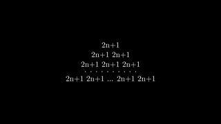
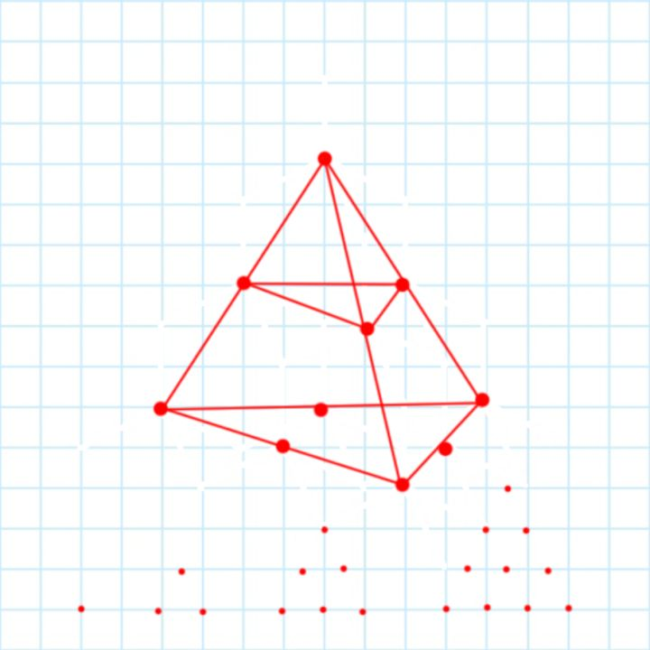
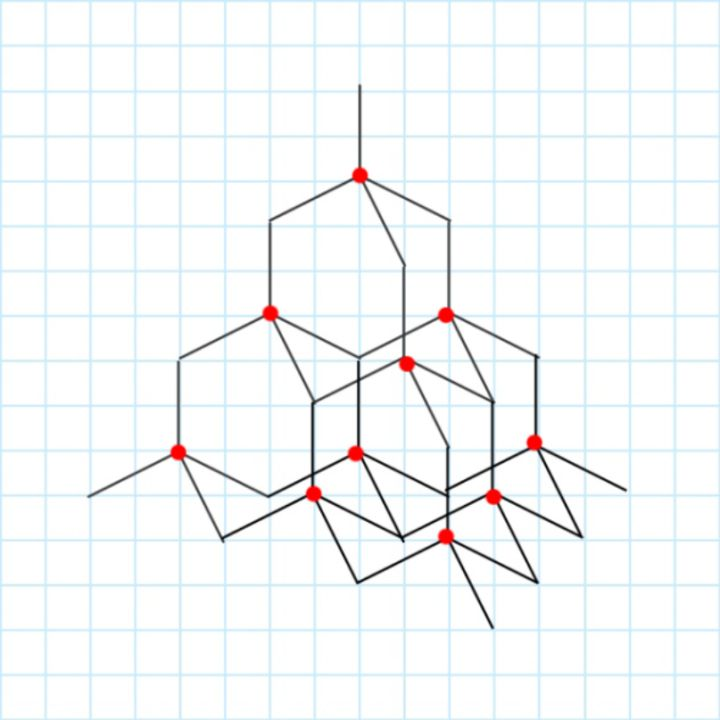

# Calculate Faulhaber's formula figuratively

## Background   
The following message is picked up from the wikipedia:
> ## Faulhaber's formula
>In mathematics, Faulhaber's formula, named after Johann Faulhaber, expresses the sum of the p-th powers of the first n positive integers.https://en.wikipedia.org/wiki/Faulhaber%27s_formula

>

> ## Figurate number
>The term figurate number is used by different writers for members of different sets of numbers, generalizing from triangular numbers to different shapes (polygonal numbers) and different dimensions (polyhedral numbers). https://en.wikipedia.org/wiki/Figurate_number

## My Idea about it
### The Animation

Just watch the video and then you will know what I am talking about.

(The animation are implemented by manim.)

### Explaination
As you see, through taking apart the quadratic term,we get back the additivity. And through adding them after central symmetrily rotation, we got the sum of quadratic Faulhaber's formula.

The inspiration was taken from the Gaussian quadrature.The talented way which Guass used to solve the sum from 1 to 100 in his childhood.

**The main idea of my method is to regain the additivity of these High-order term by explaning them figuratively.**

 Now let's use this method to solve the sum of 3-th power.Take S2 = 1 + 2^3 for example. Seperate 2^3 into 2*2 and 2. And now,you got four 2. The next what you should do is to arrange them in a approperly way. Maybe you would try rectangular pyramid since 2 can be arranged as a square. But it loss central symmetry.If you try cube,you will find the number "n" is not enough to fill the rest space.

 According to my ituition,I find the model of diamond is proper in some way.

(I hope you could understand this picture.I couldn't fix the axis any better.)

If you are sharp enough,you will find one bug in it.That's, the central's value of each model is larger than other place.

Actually I didn't work out why it happend. It doesn't work as perfect as 2-Order and 1-Order.(If you like ,you can say 0-Order is the situation sum up lots of dot just to get one natural num.) But the bug is lovely enough, according to my ituition, the sum of the red dots is half of the sum of 1-th and 2-th Faulhaber's formula.

## Expressed High order Formula regcursively
> S3(n) means the sum of the p-th powers which p equals -3

S3(n) = [(1+3*n)*S2(n)]/(4) + 0.125*S1 + 0.125*S2

S4(n) = [(1+4*n)*S3(n)]/(5) + 0.200*S1 + 0.400*S2 + 0.200*S3

S5(n) = [(1+5*n)*S4(n)]/(6) + 0.194*S1 + 0.667*S2 + 0.722*S3 + 0.250*S4

S6(n) = [(1+6*n)*S5(n)]/(7) + 0.143*S1 + 0.786*S2 + 1.429*S3 + 1.071*S4 + 0.286*S5

S7(n) = [(1+7*n)*S6(n)]/(8) + 0.104*S1 + 0.750*S2 + 2.021*S3 + 2.500*S4 + 1.438*S5 + 0.312*S6

S8(n) = [(1+8*n)*S7(n)]/(9) + 0.111*S1 + 0.704*S2 + 2.333*S3 + 4.148*S4 + 3.889*S5 + 1.815*S6 + 0.333*S7

S9(n) = [(1+9*n)*S8(n)]/(10) + 0.130*S1 + 0.800*S2 + 2.600*S3 + 5.600*S4 + 7.420*S5 + 5.600*S6 + 2.200*S7 + 0.350*S8
